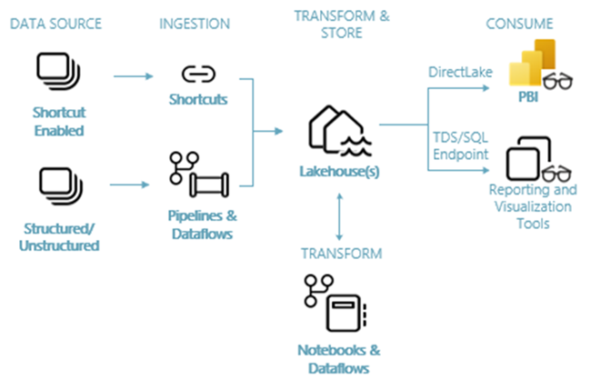
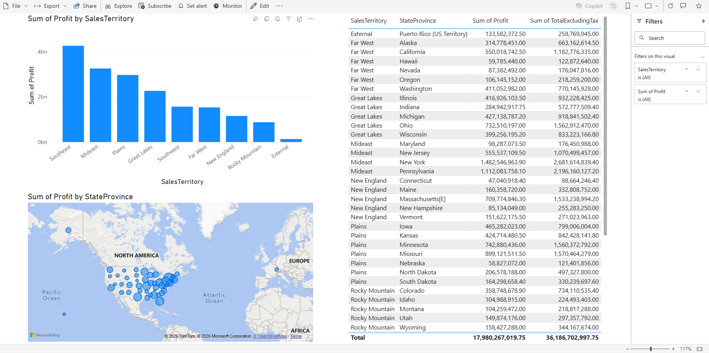

# 🏪 Wide World Importers — Microsoft Fabric End-to-End Lakehouse Pipeline

An end-to-end data engineering and analytics solution built on **Microsoft Fabric**, implementing a full Medallion Lakehouse architecture (Bronze → Silver → Gold) using PySpark notebooks, Data Factory pipelines, a Direct Lake Semantic Model, and a Power BI report — all within a single unified OneLake environment.

---

## 📐 Architecture Overview

```
Data Source                Ingestion              Storage & Compute              Serving
───────────────            ─────────              ─────────────────              ───────
Azure Public Blob ──► Data Factory Pipeline ──► OneLake Lakehouse
(Parquet files)            (Copy Activity)        ├── Bronze (raw Parquet)
                                                   ├── Silver (Delta tables)    ──► SQL Analytics
                                                   └── Gold  (aggregated         Endpoint
                                                       Delta tables)
                                                         │
                                                   Semantic Model           ──► Power BI Report
                                                   (Direct Lake mode)           (Bar chart, Map,
                                                                                 Table)
```



**Key Services Used:**
- **Microsoft Fabric Data Factory** — Pipeline orchestration & data ingestion via Copy Activity
- **OneLake** — Unified storage layer; all data stored natively in Delta Parquet format
- **Fabric Lakehouse** — Medallion architecture storage with automatic SQL Analytics Endpoint
- **PySpark Notebooks** — Code-first data transformation across Bronze → Silver → Gold layers
- **Incremental Load** — Merge-based pattern to upsert updated months into existing Delta tables
- **SQL Analytics Endpoint** — Read-only T-SQL interface auto-generated over all Delta tables
- **Semantic Model (Direct Lake)** — Full star-schema model querying OneLake directly, no data import or refresh cycle
- **Power BI** — Interactive report built on top of the Direct Lake Semantic Model

---

## 📦 Dataset

**Source:** [Wide World Importers (WWI)](https://learn.microsoft.com/en-us/sql/samples/wide-world-importers-what-is) — Microsoft Sample Database

Wide World Importers is a fictional wholesale novelty goods importer and distributor operating from San Francisco. The dataset models a complete retail operation including sales transactions, customers, cities, employees, and stock items.

**Data model used in this project (Sale fact + correlated dimensions):**

| Table | Type | Description |
|---|---|---|
| `fact_sale` | Fact | Core sales transactions — the central fact table |
| `dimension_city` | Dimension | City and region metadata |
| `dimension_customer` | Dimension | Customer details |
| `dimension_date` | Dimension | Date hierarchy (year, quarter, month) |
| `dimension_employee` | Dimension | Sales employee data |
| `dimension_stock_item` | Dimension | Product/stock item metadata |

**Data volume:** The `fact_sale` table contains 11 months of historical data (initial load) plus 3 months of incremental data — covering updated records for existing months and new month additions.

**Ingestion source:** Data is stored in Parquet format in a public Azure Blob Storage account and pulled directly into the Lakehouse via a Data Factory Copy Activity pipeline — no manual file uploads required.

---

## 🔁 Pipeline Design — Data Factory

A Data Factory pipeline with a **Copy Activity** ingests all source tables from the public Azure Blob Storage account into the `Files/` section of the Lakehouse (Bronze raw landing zone).

- Source: Azure Blob Storage (public, Parquet format, one folder per table)
- Sink: Fabric Lakehouse `Files/wwi-raw-data/full/` directory
- All dimension tables and the `fact_sale` historical dataset are copied in a single pipeline run

---

## 🥉 Bronze Layer — Raw Ingestion

Raw Parquet files land in the `Files/` section of the Lakehouse exactly as received from the source — no transformation applied. This preserves the original data for reprocessing if needed.

```
Lakehouse/
└── Files/
    └── wwi-raw-data/
        └── full/
            ├── fact_sale_1y_full/       ← 11 months of historical sales
            ├── dimension_city/
            ├── dimension_customer/
            ├── dimension_date/
            ├── dimension_employee/
            └── dimension_stock_item/
```

---

## 🥈 Silver Layer — Transformation (PySpark Notebook)

A PySpark notebook reads the raw Parquet files from Bronze, applies transformations, and writes them as **Delta tables** into the `Tables/` section of the Lakehouse. Delta format enables ACID transactions, schema enforcement, and time travel — and makes tables immediately queryable via the SQL Analytics Endpoint.

### Transformations Applied

**1. Fact table — partitioned Delta write with derived date columns**
```python
from pyspark.sql.functions import col, year, month, quarter

df = spark.read.format("parquet").load('Files/wwi-raw-data/full/fact_sale_1y_full')
df = df.withColumn('Year',    year(col("InvoiceDateKey"))) \
       .withColumn('Quarter', quarter(col("InvoiceDateKey"))) \
       .withColumn('Month',   month(col("InvoiceDateKey")))

df.write.mode("overwrite").format("delta") \
    .partitionBy("Year", "Quarter") \
    .save("Tables/dbo/fact_sale")
```

**2. Dimension tables** — all five dimensions written as Delta tables under `Tables/dbo/`

**3. Aggregate Gold tables** — summary tables created from Silver Delta tables for optimised BI querying:
```python
df_fact_sale      = spark.read.format("delta").load("Tables/dbo/fact_sale")
df_dimension_date = spark.read.format("delta").load("Tables/dbo/dimension_date")
df_dimension_city = spark.read.format("delta").load("Tables/dbo/dimension_city")
# ... joined and aggregated into Gold tables
```

---

## 🔄 Incremental Load

After the initial historical load, the tutorial demonstrates a **merge-based incremental pattern** — a core production data engineering technique:

- Updated records for **October and November** are merged into the existing `fact_sale` Delta table (upsert — matching rows updated, new rows inserted)
- **December** data is appended as a net-new month

This simulates how real pipelines handle arriving data without full reloads, using Delta Lake's native `MERGE` operation.

---

## 🥇 Gold Layer — Aggregated Delta Tables

The Gold layer contains pre-aggregated Delta tables optimised for BI consumption. These are created from Silver Delta tables inside the same PySpark notebook and stored under `Tables/dbo/` alongside the Silver tables, ready for the Semantic Model.

---

## 📊 Semantic Model & Power BI Report

### Semantic Model (Direct Lake mode)
The Semantic Model is created directly from the Lakehouse SQL Analytics Endpoint. All tables are included and a full **star-schema** relationship model is defined:

- `fact_sale` → `dimension_city` (via `CityKey`, Many:1)
- `fact_sale` → `dimension_customer` (via `CustomerKey`, Many:1)
- `fact_sale` → `dimension_date` (via `InvoiceDateKey`, Many:1)
- `fact_sale` → `dimension_employee` (via `SalespersonKey`, Many:1)
- `fact_sale` → `dimension_stock_item` (via `StockItemKey`, Many:1)

**Direct Lake mode** means Power BI queries the Delta tables in OneLake directly — no data is imported or duplicated into the semantic model, and there is no scheduled refresh cycle needed.

### Power BI Report
Built on top of the Direct Lake Semantic Model with three visuals:

- **Bar chart** — Sales performance comparison across dimensions
- **Map** — Geographic distribution of sales by city/region
- **Table** — Detailed transactional drill-down view



---

## 🔑 Key Concepts Demonstrated

| Concept | Implementation |
|---|---|
| Medallion Architecture | Bronze (raw Parquet) → Silver (Delta tables) → Gold (aggregated Delta) |
| Delta Lake | All Lakehouse tables stored in open Delta format with ACID guarantees |
| Incremental Load | Merge-based upsert pattern using Delta's native MERGE operation |
| SQL Analytics Endpoint | Auto-generated T-SQL interface over all Delta tables in the Lakehouse |
| Direct Lake | Semantic Model reads Delta tables directly from OneLake — no import/refresh |
| Star Schema | Full fact + 5 dimension relationship model defined in the Semantic Model |
| OneLake | Single unified storage — all Fabric workloads (Spark, SQL, Power BI) read the same Delta files |

---

## 🗂️ Repository Structure

```
Fabric-Lakehouse-Project/
├── notebooks/
│   └── Prepare and transform data - PySpark.ipynb   ← Bronze → Silver → Gold transformations
├── README.md
```

> Note: The Data Factory pipeline and Semantic Model are configured within the Microsoft Fabric workspace UI and are not exportable as standalone files.

---

## 🛠️ Tech Stack

| Layer | Technology |
|---|---|
| Platform | Microsoft Fabric |
| Storage | OneLake (Delta Parquet format) |
| Ingestion | Fabric Data Factory (Copy Activity) |
| Compute | PySpark Notebooks (Fabric Spark runtime) |
| File Format | Parquet (Bronze) → Delta / Snappy Parquet (Silver & Gold) |
| Semantic Layer | Fabric Semantic Model (Direct Lake mode) |
| Visualization | Power BI (in-browser, Fabric-native) |
| Dataset | Wide World Importers — Microsoft Sample Database |

---

## 🚀 How to Reproduce

1. Sign up for a [Microsoft Fabric free trial](https://app.fabric.microsoft.com) (requires a Power BI account).
2. Create a new Fabric Workspace and enable the Fabric trial capacity.
3. Create a Lakehouse named `wwilakehouse`.
4. Create a Data Factory pipeline with a Copy Activity — source: the public Azure Blob (`https://assetsprod.microsoft.com/en-us/wwi-sample-dataset.zip`), sink: Lakehouse `Files/` directory.
5. Import the PySpark notebook (`Prepare and transform data - PySpark.ipynb`) and run all cells to populate Silver and Gold Delta tables.
6. From the SQL Analytics Endpoint, create a new Semantic Model, add all tables, and define star-schema relationships.
7. From the Semantic Model, select **New Report** and build the bar chart, map, and table visuals.

---

## 📊 Dataset Credit

Wide World Importers sample database by [Microsoft](https://learn.microsoft.com/en-us/sql/samples/wide-world-importers-what-is), used under the [MIT License](https://github.com/microsoft/sql-server-samples/blob/master/license.txt).
